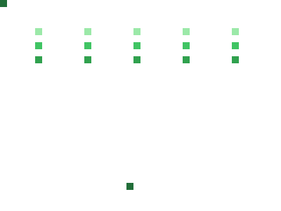

<h1 align="center">Hi , I'm Aayush Tripathi </h1>

  <em>Software Developer | Backend Developer | Infrastructure Developer | Competitive Programmer</em>

---

  
  
  
  
  
  
  
  
  
  
  
  
  
  
  
  
  
  
  
  
  
  
  
  
  

---

###  GitHub Stats

  

---

###  Projects
  Below are some projects of mine which I have worked or am currently working on. Some of the projects including the deep learning model/browser are collaborative and private for now:

- **Tundra Language**: A custom programming language built in Rust featuring a JIT backend and custom AST
- **Privacy-Focused Browser**: A desktop browser leveraging Mozilla’s Gecko engine, engineered for privacy and performance.
- **ICU Mortality Prediction**: A deep learning model trained on MIMIC and eICU datasets to predict patient mortality in real time.
- **Android Apps built on JetPack Compose with Modern MVVM Structure**: Notable apps include Synapse and a Fuzzy-GA Fitness Coach for Wear OS.
- **CodeForces Editorial Extension**: An Extension for Chromium Browsers which formats and edits the editorial onto the problem page using Gemini to improve ease and understanding.

###  Contact

  

  

